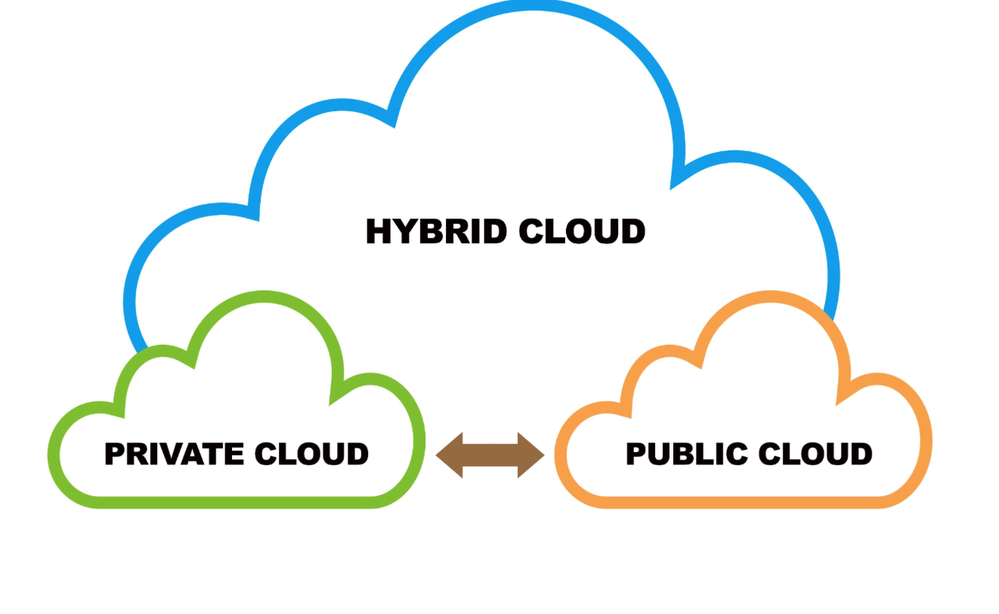

# Arquitecturas Hibridas

Las arquitecturas híbridas son, en esencia, una mezcla inteligente y estratégica de dos o más modelos arquitectónicos distintos, con el objetivo de aprovechar las fortalezas únicas de cada uno y, a la vez, mitigar sus debilidades. No se trata solo de pegar piezas, sino de integrarlas de forma que la combinación sea superior a la suma de sus partes. Piensa en ello como armar un equipo de ensueño donde cada jugador compensa lo que le falta al otro.

¿Y porque debemos de usarlas? pues basicamente porque te da lo mejor de los 2 mundos:

1. **Seguridad y Control:** Puedes guardar los datos más sensibles (como información de clientes o propiedad intelectual) en tu nube privada.

2. **Flexibilidad y Costo-Efectividad:** Usas la nube pública para picos de demanda o para tareas que no son tan críticas, pagando solo por lo que consumes (lo que llamamos escalabilidad bajo demanda).
-------
Combinar un núcleo centralizado (autenticación, catálogos, control, moderación, SLOs) con un plano P2P (distribución, cacheo entre clientes, baja latencia local) para ganar escalabilidad, coste/beneficio y resiliencia sin perder control. En streaming, la variante clásica es CDN + P2P asistido por pares.

## 1. ¿Qué problemas resuelven?

* **Picos de demanda y “flash crowds” sin sobredimensionar servidores:** el CDN “siembra” y los pares atienden parte de las peticiones, bajando coste sin degradar calidad.

* **Latencia y throughput mejores al acercar los datos al usuario (edge/CDN y vecinos P2P):** En operaciones a escala, alinear CDNs y caché de borde es clave para experiencia “instantánea”. (Spotify Engineering)

* **Resiliencia:** si un origen/edge falla, los pares pueden sostener parte del tráfico; el servidor central realiza admisión y orquestación para mantener QoS.

* **Uso eficiente del ancho de banda del proveedor:** offloading a clientes reduce egress del origen/CDN, especialmente útil en fases tempranas de un producto. (Spotify Engineering)

**Resumen:** El híbrido integra CDN (capacidad garantizada, control) con P2P (capacidad agregada y cercana), con análisis formal de políticas de contribución de pares para equilibrar costo/calidad.

## 2. ¿Qué elementos Cliente-Servidor y P2P hay en un híbrido?

### Plano Cliente-Servidor (centralizado):

* Auth & perfiles (identidad, sesiones, permisos).

* Catálogo/índices y señalización: directorio de contenidos/peers, trackers o index servers; decide quién sirve qué y cuándo.

* Orígenes/CDN: siembra inicial, fallback y políticas de caché/borrado; puede re-entrar si baja la oferta P2P.

* Observabilidad y moderación: métricas, SLAs, cumplimiento.

### Plano P2P (descentralizado):

* Peers con caché (chunks/segmentos) que suben a otros.

* Descubrimiento y sesión: DHT/trackers o señalización WebRTC; ICE + STUN/TURN para atravesar NAT (directo si se puede, relay si no). (MDN Web Docs)

* Políticas de contribución: límites de tiempo/sesiones para evitar sobrecarga o free-riding.

## 3. ¿Por qué Spotify adoptó (y luego abandonó) el modelo híbrido?

**Etapa inicial (desktop):** Spotify combinó cliente “grueso” + protocolos propios + P2P para lograr reproducción casi instantánea y reducir costes de ancho de banda frente al puro client-server, en una época con CDNs menos maduros y el reto de “ganarle a la piratería” en conveniencia y velocidad. (Spotify Engineering)

**Transición (2014):** La empresa apagó P2P en el cliente de escritorio al expandir su huella de servidores globales; mantener P2P añadía overhead de complejidad y las apps móvil/web nunca usaron P2P. (TechCrunch)

**Arquitectura actual (alto nivel):** Spotify optimiza multi-CDN y edge para streaming de audio y otros activos, estandarizando operaciones para baja latencia y alto ancho de banda (Fastly/Akamai, gobernanza, VCL, métricas). (Spotify Engineering)

**Lectura analítica (motivaciones probables, además de lo declarado):**

* **Móvil > Desktop:** P2P penaliza batería/datos y sufre con NATs estrictos; TURN/relay encarece y aumenta latencia. (Marcos técnicos sobre STUN/TURN y relés). (WebRTC)

* **Suficiente edge capacity:** con CDNs globales, el beneficio marginal del P2P disminuye frente a su complejidad operativa. (Post de ingeniería y nota 2014). (Spotify Engineering)

## 4. Ejemplo práctico: diseño híbrido para una red social universitaria

Objetivo: Feed de posts, mensajería y media (fotos/videos/archivos) con coste bajo, latencia local en campus y control de moderación.

### Vista de alto nivel (componentes)

* **Servicios centrales (microservicios en cloud o datacenter de la Uni):** Autenticación (SSO/OAuth Univ), Perfiles/Grupos, Posts/Comentarios, Moderación/Trust&Safety, Búsqueda, Notificaciones, API-Gateway, Observabilidad. Storage: objetos (media), BD relacional/noSQL para sociales.

* **Entrega de contenido (híbrida):** CDN (edge público o PoP en campus) + Peer-Assisted Delivery vía WebRTC DataChannels entre alumnos cerca (misma red Wi-Fi/LAN) para adjuntos populares (chunks con TTL y verificación). Fallback a CDN siempre. (MDN Web Docs)

* **Señalización/descubrimiento:** Servicio central que expone candidatos ICE y políticas; STUN para IP pública y TURN solo cuando NAT lo exige. (Reduce costos y cuida batería). (MDN Web Docs)

* **“Super-peers” opt-in (cachés de laboratorio):**
 PCs del aula o mini-servers que actúan como seeders autenticados en horarios de clase para acelerar entregas de media en el campus. (Políticas de cuota y auditoría).

 ### Flujo típico (subida/descarga de vídeo)

 1. Alumno A sube vídeo → origen (bucket) + hash/chunk manifest.

2. CDN publica en edge; señalización ofrece pares cercanos con el chunk en caché.

3. Alumno B solicita → obtiene mix: CDN edge + 2-3 peers campus (con límites de contribución y verificación de integridad). Si hay NAT restrictivo, B usa TURN.

### Seguridad, privacidad y control

* **Cifrado extremo a extremo en P2P** (DTLS/SRTP/SCTP según canal), tokens firmados para chunks, moderación central (hash-lists, reportes, Takedown → purge CDN + invalidación de cachés P2P). (IETF)

* **Límites e incentivos:** ancho de subida por peer, tiempos de servicio y reputación para evitar free-riding; políticas ya estudiadas en híbridos CDN-P2P.

### Métricas/SLOs sugeridos

* p95 Time-to-first-byte y Rebuffer ratio (media).

* Offload P2P/CDN (% bytes servidos por pares).

* Hit ratio de cachés (edge y super-peers).

* Coste por GB egress (comparativo con/ sin P2P).

### Riesgos y mitigaciones

* **NATs estrictos / campus firewall:** tener TURN propio (coturn), pero usarlo solo como fallback. (WebRTC)

* **Batería en móviles:** no exigir uplink sostenido; upload caps y solo en Wi-Fi.

* **Contenido indebido:** hash-matching, moderación activa y trazabilidad de chunk-signatures (sin exponer identidad a otros peers).

## Conclusion

* Híbridas = control central + potencia agregada en el borde: menos coste y más rendimiento en picos.

* Spotify usó híbrida para velocidad y coste al principio; la dejó cuando su CDN global y el uso móvil hicieron más eficiente el modelo centralizado. (TechCrunch)

* Tu red social universitaria puede ganar mucho con peer-assisted delivery (WebRTC) + CDN + señalización central, con seguridad y moderación en el núcleo. (MDN Web Docs)

## Fuentes 

* **Xu et al., CDN–P2P híbrido (análisis y políticas de contribución).**

* **Spotify Engineering (alineación de CDNs; lecciones del desktop y P2P). (Spotify Engineering)**

* **TechCrunch (2014): apagado del P2P en desktop; móvil/web nunca fueron P2P. (TechCrunch)**

* **MDN/WebRTC: ICE, STUN, TURN y DataChannels. (MDN Web Docs)**

